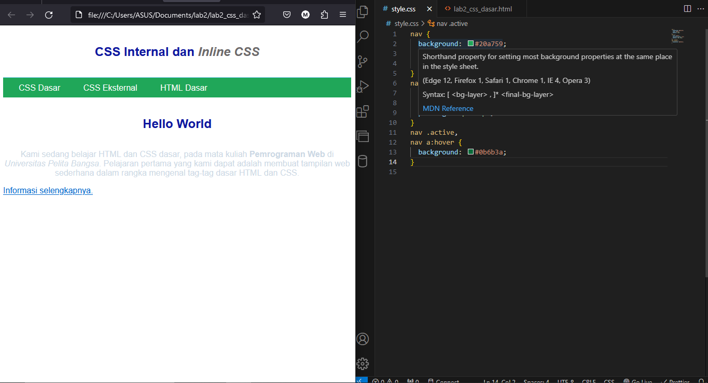
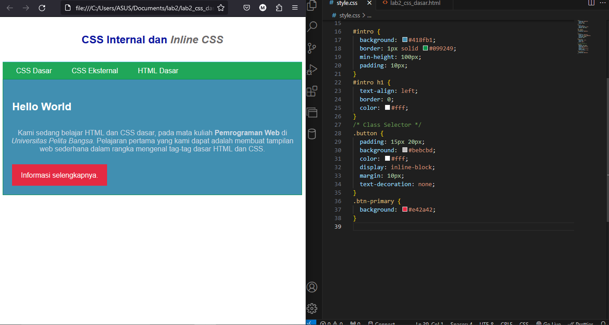

# Praktikum 2

## 1. Membuat dokumen HTML
Buatlah dokumen HTML seperti berikut:


## 2. Mendeklarasikan CSS Internal
Kemudian tambahkan deklarasi CSS internal seperti berikut pada bagian head dokumen.


## 3. Menambahkan Inline CSS
Kemudian tambahkan deklarasi inline CSS pada tag <p> seperti berikut.


## 4. Membuat CSS Internal
Buatlah file baru dengan nama `style_eksternal.css` kemudian buatlah deklarasi CSS seperti berikut.



## 5. Menambahkan CSS Selector
Selanjutnya menambahkan CSS Selector menggunakan ID dan Class Selector. Pada file
`style_eksternal.css`, tambahkan kode berikut.



## Pertanyaan dan Tugas!
1. Lakukan eksperimen dengan mengubah dan menambah properti dan nilai pada kode CSS dengan mengacu pada CSS Cheat Sheet yang diberikan pada file terpisah dari modul ini.
2. Apa perbedaan pendeklarasian CSS elemen h1 {...} dengan #intro h1 {...}? berikan penjelasannya!
3. Apabila ada deklarasi CSS secara internal, lalu ditambahkan CSS eksternal dan inline CSS pada elemen yang sama. Deklarasi manakah yang akan ditampilkan pada browser? Berikan penjelasan dan contohnya!
4. Pada sebuah elemen HTML terdapat ID dan Class, apabila masing-masing selector tersebut terdapat deklarasi CSS, maka deklarasi manakah yang akan ditampilkan pada browser? Berikan penjelasan dan contohnya! ( <p id="paragraf-1" class="text-paragraf"> )

## Jawaban
1. saya akan mengubah properti html dan css internal


2. Pendeklarasian CSS "h1 {...}" memilih semua elemen "h1" di halaman, sedangkan "#intro h1 {...}" memilih hanya elemen "h1" yang berada di dalam elemen dengan ID "intro". Ini memungkinkan Anda untuk mengkustomisasi gaya elemen secara lebih spesifik dengan kombinasi selektor.

3. Secara singkat, dalam CSS, jika ada deklarasi CSS yang diterapkan secara internal, eksternal, dan inline pada elemen yang sama, maka inline CSS akan memiliki prioritas tertinggi dan akan menggantikan atau mengesampingkan deklarasi CSS lainnya.
Contoh:
```
<button style="background-color: green;">Tombol</button>
```
Dalam contoh di atas, warna latar belakang tombol akan menjadi hijau sesuai dengan inline CSS, dan ini akan menggantikan aturan CSS lainnya yang mungkin didefinisikan secara internal atau eksternal.

4. Ketika sebuah elemen HTML memiliki ID dan Class yang diberikan, dan keduanya memiliki deklarasi CSS, maka ID akan memiliki prioritas yang lebih tinggi daripada Class dalam menentukan gaya elemen tersebut. Ini disebabkan oleh aturan Specificity (Spesifikasi) dalam CSS, di mana ID memiliki bobot yang lebih tinggi daripada Class.
Contoh:

```
<p id="paragraf-1" class="text-paragraf">Ini adalah paragraf</p>
```

Jika ada deklarasi CSS seperti ini:

```
#paragraf-1 {
  color: red;
}

.text-paragraf {
  color: blue;
}
```

Maka teks dalam elemen `<p>` akan ditampilkan dengan warna merah, karena deklarasi dengan ID memiliki prioritas lebih tinggi daripada deklarasi dengan Class.
Namun, jika deklarasi CSS untuk ID dan Class memiliki properti yang sama, seperti berikut:

```
#paragraf-1 {
  color: red;
}

.text-paragraf {
  color: blue;
  font-weight: bold;
}
```

Maka teks dalam elemen `<p>` akan ditampilkan dengan warna merah (dari deklarasi ID), tetapi juga akan memiliki tebal (font-weight: bold) dari deklarasi Class. Dalam hal ini, properti yang berbeda antara ID dan Class akan diterapkan pada elemen yang sama.
